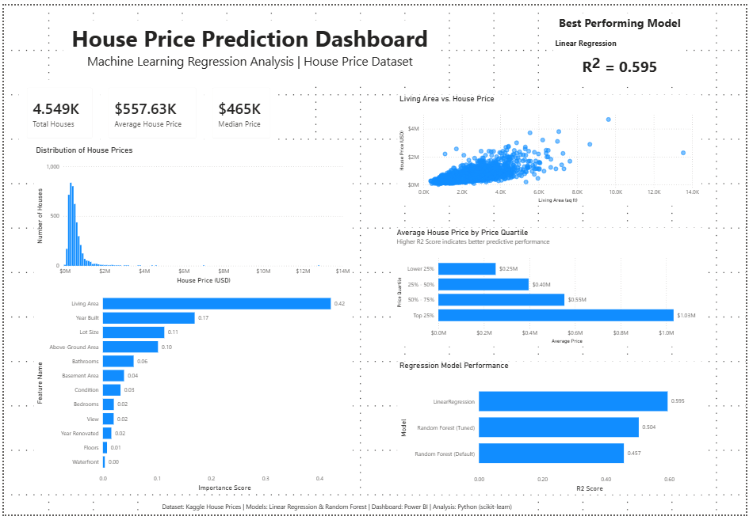

# House Price Prediction

A machine learning project that predicts house prices using regression models in Python. The project follows a complete machine learning workflow, including data exploration, cleaning, feature selection, model training, evaluation, and model comparison.

## Dataset

- **Source:** Kaggle – House Prices Dataset
- **Records:** 4,600 houses
- **Target Variable:** `price`
- **Features:** Property characteristics such as bedrooms, bathrooms, living area, lot size, floors, condition, year built, and more.

### Data Quality

-  No missing values
-  No duplicate records
-  Removed invalid records with a selling price of **$0**
-  Removed houses with zero bedrooms or zero bathrooms

## Exploratory Data Analysis

The dataset was explored using:

- Distribution of house prices
- Correlation heatmap
- Scatter plots
- Boxplots
- Outlier analysis

The analysis revealed several luxury properties and invalid price records that significantly affected model performance.

## Project Workflow

1. Load Dataset
2. Data Exploration
3. Data Cleaning
4. Exploratory Data Analysis
5. Feature 
6. Train-Test Split
7. Linear Regression
8. Model Evaluation
9. Investigate Prediction Errors
10. Improve Data Quality
11. Random 
12. Hyperparameter Tuning
13. Model Comparison

## Models Evaluated

- Linear Regression
- Random Forest Regressor (Default)
- Random Forest Regressor (Tuned)

## Model Performance

| Model | MAE | RMSE | R² |
|-------|------:|------:|------:|
| Linear Regression | **$166,236** | **$250,419** | **0.595** |
| Random Forest | $174,217 | $289,939 | 0.457 |
| Random Forest (Tuned) | $171,591 | $276,983 | 0.504 |

## Key Findings

- Data cleaning significantly improved model performance.
- Removing invalid records resulted in a large increase in prediction accuracy.
- Linear Regression outperformed both Random Forest models using the selected numerical features.
- Living area (`sqft_living`) was the most influential feature in the Random Forest model.

## Technologies Used

- Python
- Pandas
- NumPy
- Matplotlib
- Seaborn
- Scikit-learn
- Jupyter Notebook

## Future Improvements

- Include location-based features such as city and ZIP code.
- Perform automated hyperparameter tuning using GridSearchCV or RandomizedSearchCV.
- Explore additional regression models such as XGBoost or Gradient Boosting.

## Project Structure


```text
house-price-prediction/

├── data/
│   ├── data.csv
│   ├── cleaned_house_prices.csv
│   ├── model_comparison.csv
│   └── feature_importance.csv

├── notebooks/
│   └── House_Price_Prediction.ipynb

├── dashboard/
│   └── HousePriceDashboard.pbix

├── images/
│   ├── dashboard.png
│   ├── distribution.png
│   ├── scatterplot.png
│   └── feature_importance.png

├── README.md

└── requirements.txt
```

## Dashboard

